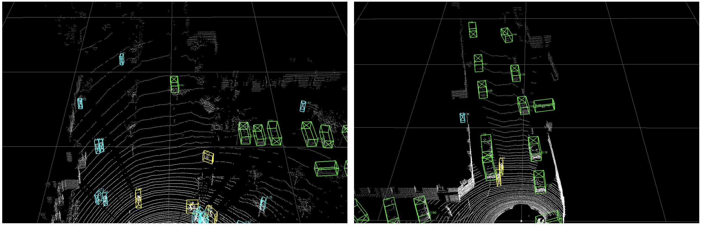

# Research Project Source Code

## Introduction
The code is based on OpenPCDet v0.3.0.
More updates on OpenPCDet are supposed to be compatible with our code.

## Model Zoo

### Waymo -> KITTI TASK

|                                                                                             |     method     | Car@R40 | Ped@R40 | Cyc@R40 | 
|---------------------------------------------------------------------------------------------|:--------------:|:-------:|:-------:|:-------:|
| [SECOND-IoU-GT](tools/cfgs/da-waymo-kitti_models/secondiou/secondiou_gt.yaml) | Tuned Anchor (Our) | 64.36 | 49.31 | 55.97
| [SECOND-IoU-LD](tools/cfgs/da-waymo-kitti_models/secondiou/secondiou_ld.yaml) | Tuned Anchor (Our) | 64.92 | 39.10 | - 
| [SECOND-IoU](tools/cfgs/da-waymo-kitti_models/secondiou/secondiou_car.yaml)              | Tuned Anchor(Our)  |  64.03
| [SECOND-IoU](tools/cfgs/da-waymo-kitti_models/secondiou/secondiou_st3d_car.yaml)            |      ST3D      |  62.19  |  48.33  |  46.09  | 
| [SECOND-IoU](tools/cfgs/da-waymo-kitti_models/secondiou_st3d/secondiou_st3d_car.yaml)       |  ST3D (w/ sn)  |  73.62  |  51.92  |  53.00  |
| [SECOND-IoU](tools/cfgs/da-waymo-kitti_models/secondiou_st3d/secondiou_st3d++_ros_car.yaml) |     ST3D++     |  65.10  |  53.87  |  53.43  |
| [SECOND-IoU](tools/cfgs/da-waymo-kitti_models/secondiou_st3d/secondiou_st3d++_sn_car.yaml)  | ST3D++ (w/ sn) |  74.73  |  59.21  |  60.76  |
| [PVRCNN](tools/cfgs/da-waymo-kitti_models/pvrcnn_st3d/pvrcnn_st3d.yaml)                     |      ST3D      |  64.05  |    -    |    -    |
| [PVRCNN](tools/cfgs/da-waymo-kitti_models/pvrcnn_st3d/pvrcnn_st3d.yaml)                     |  ST3D (w/ sn)  |  77.33  |    -    |    -    |
| [PVRCNN_GT](tools/cfgs/da-waymo-kitti_models/pvrcnn/pvrcnn_car_gt.yaml)                     | Tuned anchor(our) | 60.33

### nuScenes -> KITTI TASK
|                                                                                                |     method     | Car@R40 | 
|------------------------------------------------------------------------------------------------|:--------------:|:-------:|
| [SECOND-IoU-GT](tools/cfgs/da-nuscenes-kitti_models/secondiou/secondiou_car_gt.yaml) | Tuned Anchor (Our) | 46.34
| [SECOND-IoU](tools/cfgs/da-nuscenes-kitti_models/secondiou/secondiou_old_anchor.yaml)          |  Source Only   |  17.92  |   
| [SECOND-IoU](tools/cfgs/da-nuscenes-kitti_models/secondiou/secondiou_old_anchor_ros.yaml)      |      ROS       |  25.37  |    
| [SECOND-IoU](tools/cfgs/da-nuscenes-kitti_models/secondiou/secondiou_old_anchor_sn.yaml)       |       SN       |  21.23  |  
| [SECOND-IoU](tools/cfgs/da-nuscenes-kitti_models/secondiou_st3d/secondiou_st3d_car.yaml)       |      ST3D      |  55.19  |    
| [SECOND-IoU](tools/cfgs/da-nuscenes-kitti_models/secondiou_st3d/secondiou_st3d_car.yaml)       |  ST3D (w/ SN)  |  62.27  |   
| [SECOND-IoU](tools/cfgs/da-nuscenes-kitti_models/secondiou_st3d/secondiou_st3d++_ros_car.yaml) |     ST3D++     |  66.01  |  
| [SECOND-IoU](tools/cfgs/da-nuscenes-kitti_models/secondiou_st3d/secondiou_st3d++_sn_car.yaml)  | ST3D++ (w/ SN) |  66.24  |  
| [PV-RCNN](tools/cfgs/da-nuscenes-kitti_models/pvrcnn/pvrcnn_old_anchor.yaml)                   |  Source Only   |  37.17  |  
| [PV-RCNN](tools/cfgs/da-nuscenes-kitti_models/pvrcnn/pvrcnn_old_anchor_ros.yaml)               |      ROS       |  38.84  |    
| [PV-RCNN](tools/cfgs/da-nuscenes-kitti_models/pvrcnn/pvrcnn_old_anchor_sn.yaml)                |       SN       |  49.47  |   
| [PV-RCNN](tools/cfgs/da-nuscenes-kitti_models/pvrcnn_st3d/pvrcnn_st3d.yaml)                    |      ST3D      |  71.11  |    
| [PV-RCNN](tools/cfgs/da-nuscenes-kitti_models/pvrcnn_st3d/pvrcnn_st3d.yaml)                    |  ST3D (w/ SN)  |  73.16  |   
| [PV-RCNN](tools/cfgs/da-nuscenes-kitti_models/pvrcnn/pvrcnn_car_gt.yaml) | Tuned Anchor (Our) | 54.72
| [PointRCNN](tools/cfgs/da-nuscenes-kitti_models/pointrcnn/pointrcnn.yaml)                      |      ROS       |  55.92  |    
| [PointRCNN](tools/cfgs/da-nuscenes-kitti_models/pointrcnn_st3d/pointrcnn_st3d++_car.yaml)      |    ST3D++      |  67.51  |  

### Waymo -> nuScenes TASK
|                                             | method | Car@R11 | Car@R40 | download | 
|---------------------------------------------|----------:|:-------:|:-------:|:---------:|
| [SECOND-IoU](tools/cfgs/da-waymo-nus_models/secondiou/secondiou_car.yaml) | Tuned Anchor(Our) | 19.35 |  |  |
| [SECOND-LD](tools/cfgs/da-waymo-nus_models/second/second_ld.yaml) | Tuned Anchor(Our) | 23.46 |  |  |
| [SECOND-IoU](tools/cfgs/da-waymo-nus_models/secondiou_st3d/secondiou_st3d.yaml) | ST3D | 23.24 | 20.19 |  | 
| [PVRCNN](tools/cfgs/da-waymo-nus_models/pvrcnn_st3d/pvrcnn_st3d.yaml)    | ST3D | 27.18 | 22.99 |  |
| [SECOND-IoU](tools/cfgs/da-waymo-nus_models/secondiou_st3d/secondiou_st3d.yaml) | ST3D (w/ sn) | 23.52 | 20.38 | | 
| [PVRCNN](tools/cfgs/da-waymo-nus_models/pvrcnn_st3d/pvrcnn_st3d.yaml)    | ST3D (w/ sn)   | 28.06 | 23.67 | |

## Installation

Please refer to [INSTALL.md](docs/INSTALL.md) for the installation.

## Getting Started

Please refer to [GETTING_STARTED.md](docs/GETTING_STARTED.md) to learn more usage about this project.

## For Demo
Please refer to [DEMO.md](docs/DEMO.md), for visualization of detections, and point cloud data.

## Sample Detection Visualization

  

## Acknowledgement

Our code is heavily based on [OpenPCDet v0.3](https://github.com/open-mmlab/OpenPCDet/commit/e3bec15f1052b4827d942398f20f2db1cb681c01). Thanks OpenPCDet Development Team for their awesome codebase.

